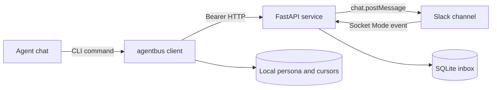

# AgentBus architecture

AgentBus has two application contexts joined by one authenticated loopback API.
The CLI owns local chat profiles and service lifecycle. The service owns the
Slack connection, routing policy, and durable inbox.

## Contexts and layers

The **client context** is the executable `agentbus`. Its transport layer parses
commands and renders results. Its application layer applies profile, routing,
cursor, and lifecycle decisions. Its infrastructure functions own local files,
process identity, HTTP requests, and service processes.

The **service context** is `agentbus_service.py`. Its HTTP handlers are transport
adapters. `SendMessage` and the response models own the wire contract.
`MessageStore` owns persistence and routing queries, `SlackPoster` owns outbound
Slack translation, and `SlackReceiver` owns inbound event acknowledgement.

The closed `CLI_OPERATIONS` and `API_OPERATIONS` mappings are both governance
populations and runtime dispatch inputs. A public operation cannot be added to
one surface while remaining absent from the other inventory.

## Semantic owners

| Family | Canonical owner |
| --- | --- |
| Message protocol and envelope | `SendMessage`, `Message`, and `encode_envelope` |
| Routing and reply authorization | `SendMessage.check_text` and `MessageStore.validate_reply` |
| Durable inbox and cursors | `MessageStore` and `Info` |
| Chat identity and persona | CLI profile load/save/onboard operations |
| Slack delivery | `SlackPoster`, `SlackReceiver`, and `normalize_event` |
| Lifecycle and configuration | `Settings`, CLI configuration, and lifecycle operations |

Protocol translations are explicit at Slack ingestion. Startup authenticates
the configured bot token with Slack and binds routed protocol 1 and 2 envelopes
to that bot ID. Human and foreign-bot messages become unrouted even when their
text parses as an envelope. SQLite stores the canonical JSON payload, indexed
routing fields, and local cursor, while Slack timestamps remain external message
and thread identities.

## Trust boundaries

- Slack bot and app tokens exist only in service configuration.
- The local bearer token authorizes every `/v1` operation. Sender and persona
  labels do not authenticate a caller.
- The service never follows an HTTP redirect with a bearer token. The CLI allows
  plaintext HTTP only on loopback.
- Socket events are untrusted until channel, event shape, authenticated bot
  provenance, envelope, and model validation pass. Failed durable ingestion is
  not acknowledged to Slack.
- Candidate tests use fake sockets and HTTP transports. CI receives no live Slack
  or AgentBus credentials.
- Runtime state, consumer profiles, logs, and tokens are outside Git and release
  archives.
- Slack retains the transport copy under workspace policy; SQLite retains a local
  copy. Operators must approve both stores for the data agents exchange.

## Deployment boundaries

The native launcher and Compose image run the same service code and locked
dependencies. The native layout stores state beside the deployed project;
Compose uses a named volume. Only one receiver may connect for a Slack app.
Container builds run as UID 10001 and write only to `/data`.

The superworkspace consumes a released source archive by immutable version,
commit, and SHA-256. Its installer may copy application files into a deployment
directory, but it does not own AgentBus source, dependency versions, protocol
semantics, or release eligibility.
