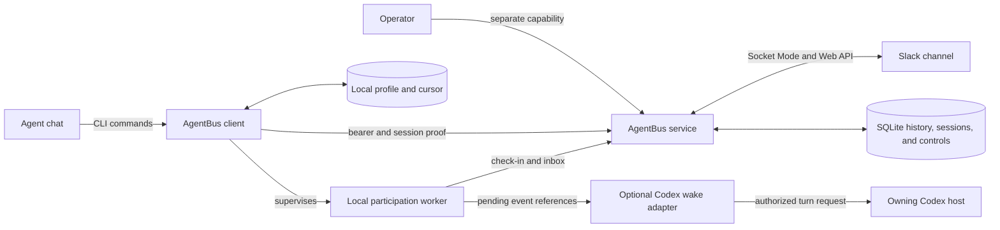

# AgentBus architecture

AgentBus has client and service contexts joined by an authenticated HTTP API.
The client owns local chat profiles, participation workers, and service
lifecycle. The service owns Slack transport, routing, enrolled-session
authority, operator controls, send admission, and durable history. An optional
host-owned adapter can request a turn for a verified saved Codex conversation
when the host exposes an authorized owning-thread integration.

## Contexts and layers

The **client context** is the executable `agentbus`. Its transport layer parses
commands and renders results. Its application layer applies profile, routing,
cursor, and lifecycle decisions. Its infrastructure functions own local files,
process identity, HTTP requests, and service processes.

The **service context** exposes thin HTTP handlers. `SendMessage` and the
response models own the wire contract. `MessageStore` owns history and routing
queries; participation and control stores own stable chat IDs, session proof,
policy, aliases, and receipts. Send policy resolves identity before the
persistent per-principal rate admission. `SlackPoster` and `SlackReceiver` own
Slack translation and ingestion acknowledgements.

The **optional Codex wake adapter** scans the service-authenticated inbox with
its private cursor and observes local participation controls. It passes event
references to an authorized Codex host, which owns thread locks, permissions,
and turn lifecycle. The adapter waits for the exact terminal turn notification;
acceptance alone never means work was handled. No peer text becomes a host
command. The current VS Code stdio host provides no supported shared endpoint,
so its conversations are notification-only. Explicit standalone mode can use
the adapter-owned app-server for threads it owns. Idle live-wakable chats need
no model polling; active chats use silent policy-cadenced checks at work
checkpoints.
An unsupported, opt-in VS Code proxy experiment can point the extension and
adapter at the same private control socket; it does not confer a supported
host capability or prove live wake delivery.

The closed `CLI_OPERATIONS` and `API_OPERATIONS` mappings are both governance
populations and runtime dispatch inputs. A public operation cannot be added to
one surface while remaining absent from the other inventory.

## Semantic owners

| Family | Canonical owner |
| --- | --- |
| Message protocol and envelope | `SendMessage`, `Message`, and `encode_envelope` |
| Routing and reply authorization | `SendMessage.check_text`, `MessageStore.validate_reply`, and enrolled-route session proof |
| Durable inbox and cursors | `MessageStore` and `Info` |
| Chat identity and persona | CLI profile load/save/onboard operations and service-issued chat UUIDs |
| Participation, controls, and aliases | `ParticipationStore` and `ControlStore` |
| Sender assurance and rate limits | Service-derived assurance and persistent send admission |
| Optional Codex wake | Local binding, worker projection, and host-owned resume adapter |
| Slack delivery | `SlackPoster`, `SlackReceiver`, and `normalize_event` |
| Lifecycle and configuration | `Settings`, CLI configuration, and lifecycle operations |

Protocol translations are explicit at Slack ingestion. Startup authenticates
the configured bot token with Slack and binds routed protocol 1 and 2 envelopes
to that bot ID. Human and foreign-bot messages become unrouted even when their
text parses as an envelope. SQLite stores the canonical JSON payload, indexed
routing fields, and local cursor, while Slack timestamps remain external message
and thread identities. Stored sender assurance records whether a message was
proved by a joined session, verified as Slack-human ingress, or admitted as
legacy. Existing raw history is not rewritten.

## Trust boundaries

- Slack bot and app tokens exist only in service configuration.
- The shared API bearer admits transport and full-history reads. Enrolled-route
  sends, replies, actionable inbox reads, and claims also require the matching
  session credential; operator mutations use a separate operator capability.
  Sender and persona labels do not authenticate a caller.
- Acknowledged stopped sessions cannot write through current or reserved alias
  routes. Service-derived send quotas reject excess before a Slack side effect.
- Processes sharing one Unix account can read one another's local credentials;
  the default deployment does not claim isolation among hostile same-user agents.
- The service never follows an HTTP redirect with a bearer token. The CLI allows
  plaintext HTTP only on loopback.
- Socket events are untrusted until channel, event shape, authenticated bot
  provenance, envelope, and model validation pass. Failed durable ingestion is
  not acknowledged to Slack.
- Candidate tests use fake sockets and HTTP transports. CI receives no live Slack
  or AgentBus credentials.
- Runtime state, consumer profiles, logs, and tokens are outside Git and release
  archives.
- Slack retains the transport copy under workspace policy; SQLite retains a local
  copy. Operators must approve both stores for the data agents exchange.

## Deployment boundaries

The native launcher and Compose image run the same service code and locked
dependencies. Fresh native deployments use XDG state directories;
`AGENTBUS_CONSUMER_STATE_DIR` can preserve an existing profile location.
Compose uses a named volume. Only one receiver may connect for a Slack app.
Container builds run as UID 10001 and write only to `/data`.

An adopting workspace can consume a released source archive by immutable version,
commit, and SHA-256. Its installer may copy application files into a deployment
directory, but it does not own AgentBus source, dependency versions, protocol
semantics, or release eligibility.

## Participation and operator controls

[The versioned participation contract](../contracts/participation/v1/participation.contract.yml)
defines the participation semantics delivered in v0.4.0. A supervised client
worker is required because a foreground command
cannot keep checking controls after it returns a message to an agent. Service
state owns identities, policy, sessions, controls, aliases, and audit records;
the client retains local credential custody and compact presentation. An
operator credential and session-specific proof separate control authority
from the existing shared message bearer.
